# CSharpCraft.Pico8 — Class & Interface Relationships

> **Color key:**
> 🔵 Blue = Interface  |  🟢 Green = Concrete class  |  🩵 Teal = Orchestrator
> 🟠 Orange = Record / value type  |  🟣 Purple = Sealed  |  🔘 Gray (dashed) = Static  |  🩷 Pink = Enum>
> **Namespace groupings** (Phase 16): Types are organized into 7 sub-namespaces
> under `CSharpCraft.Pico8`: `.Audio`, `.Graphics`, `.Input`, `.Scene`, `.Menu`, `.Models`, `.Utilities`
> Root namespace `CSharpCraft.Pico8` contains: Pico8, GameOrchestrator, GameRendering, Notifications

```mermaid
classDiagram
    direction TB

    %% ══════════════════════════════════════════
    %% Style definitions
    %% ══════════════════════════════════════════

    classDef iface fill:#d0e4f7,stroke:#4a90d9,color:#1a3a5c,stroke-width:2px
    classDef impl fill:#d4edda,stroke:#3d9140,color:#1b4332,stroke-width:1px
    classDef orch fill:#ccf2f4,stroke:#1fa2a5,color:#0d4f50,stroke-width:2px
    classDef rec fill:#fde8cd,stroke:#d48806,color:#5a3800,stroke-width:1px
    classDef enm fill:#f8d7e8,stroke:#c2185b,color:#6a0030,stroke-width:1px
    classDef stat fill:#e0e0e0,stroke:#757575,color:#2e2e2e,stroke-width:1px,stroke-dasharray:5 5
    classDef seal fill:#e8daef,stroke:#7d3c98,color:#3c1a52,stroke-width:1px

    %% ═══════════════════════════════════════════════
    %%  INTERFACES  (blue)
    %% ═══════════════════════════════════════════════

    class IAudioAPI {
        <<interface>>
        +Sfx(n, channel, offset, length)
        +Music(n, fadeLen)
    }

    class IAudioSettings {
        <<interface>>
        +bool SoundEnabled
        +int MusicVolume
        +int SfxVolume
        +int CurrentSoundtrack
        +int CurrentSfxPack
        +Save()
    }

    class IDisplaySettings {
        <<interface>>
        +bool IsFullscreen
        +int WindowWidth
        +int WindowHeight
        +Save()
    }

    class IInputBindingProvider {
        <<interface>>
        +InputBinding Keyboard_ ×7
        +InputBinding Controller_ ×7
    }

    class IInputStateManager {
        <<interface>>
        +P8Btns Buttons
        +Update()
    }

    class IGraphicsAPI {
        <<interface>>
        +Spr() Rect() Print() Line() …
    }

    class IMapManager {
        <<interface>>
        +Mget() Mset() Map()
    }

    class IPaletteManager {
        <<interface>>
        +Pal() Palt() ResetPalette()
    }

    class IScene {
        <<interface>>
        +Init() Update() Draw()
        +Music  Sfx  Cell
    }

    class ISceneManager {
        <<interface>>
        +IScene CurrentScene
        +RegisterScene() TransitionToScene()
        +ScheduleScene()
    }

    class IDisplayManager {
        <<interface>>
        +UpdateViewport(IScene)
        +ToggleFullscreen(IScene)
    }

    class ICartDataLoader {
        <<interface>>
        +CartData Load(IScene, …)
    }

    class ITextureRenderer {
        <<interface>>
        +Sspr() DrawTexture()
    }

    class IPauseMenuContext {
        <<interface>>
        +IAudioSettings AudioSettings
        +IDisplaySettings DisplaySettings
        +List~IScene~ Scenes
        +ITrackManager TrackManager
        +LoadCart() PlayMusic()
        +ToggleFullscreen() ToggleSound()
    }

    class IPauseMenuRenderer {
        <<interface>>
        +DrawPauseMenu(List~MenuItem~, …)
    }

    class IPopupService {
        <<interface>>
        +Show(string, PopupSeverity)
        +Draw() Update()
    }

    class ITrackManager {
        <<interface>>
        +NextTrack() PrevTrack()
        +NextSfxPack() PrevSfxPack()
    }

    %% ═══════════════════════════════════════════════
    %%  ORCHESTRATORS  (teal) — coordination layer
    %% ═══════════════════════════════════════════════

    class GameOrchestrator {
        -IInputStateManager _inputManager
        -GraphicsOrchestrator _graphicsOrch
        -AudioOrchestrator _audioOrch
        -ISceneManager _sceneManager
        -ICartDataLoader _cartDataLoader
        -IDisplayManager _displayManager
        -IAudioSettings _audioSettings
        -IDisplaySettings _displaySettings
        -PauseMenuState _pauseMenuState
        +Initialize() Update() Draw()
    }

    class GraphicsOrchestrator {
        -IGraphicsAPI _graphicsAPI
        +IPaletteManager PaletteManager
    }

    class AudioOrchestrator {
        -IAudioAPI _audioAPI
        +IAudioAPI API
    }

    %% ═══════════════════════════════════════════════
    %%  IMPLEMENTATIONS  (green) — one per interface
    %% ═══════════════════════════════════════════════

    class AudioAPI {
        -AudioChannels _audioChannels
        -MusicManager _musicManager
    }

    class GraphicsAPI
    class MapManager
    class PaletteManager
    class CartDataLoader
    class FnaTextureRenderer
    class PopupService {
        -IGraphicsAPI _graphics
    }

    class DisplayManager {
        -IDisplaySettings _settings
    }

    class SceneManager {
        -IScene _currentScene
        -List~IScene~ _registeredScenes
    }

    class PauseMenuRenderer {
        -IGraphicsAPI _graphics
        -ITextureRenderer _textureRenderer
    }

    class InputStateManager {
        -P8Btns _buttons
    }

    class TrackManager {
        -IAudioSettings _settings
    }

    class MusicManager {
        -Func~IAudioSettings~ getSettings
    }

    class AudioChannels {
        +Dispose()
    }

    class InputBindings
    class SpriteCache

    %% ═══════════════════════════════════════════════
    %%  SEALED / SPECIAL  (purple)
    %% ═══════════════════════════════════════════════

    class InMemorySettings {
        <<sealed>>
    }

    class DefaultInputBindings {
        <<sealed>>
        +Instance$
    }

    class NullScene {
        <<sealed>>
        +Instance$
    }

    %% ═══════════════════════════════════════════════
    %%  PAUSE MENU SUBSYSTEM  (green)
    %% ═══════════════════════════════════════════════

    class PauseMenuBuilder {
        -IPauseMenuContext _context
        -List~MenuItem~ _mainMenuItems
    }

    class PauseMenuState {
        -IPauseMenuContext _context
        -List~MenuItem~ _currentMenuItems
    }

    %% ═══════════════════════════════════════════════
    %%  RECORDS & VALUE TYPES  (orange)
    %% ═══════════════════════════════════════════════

    class GameHostContext {
        <<record>>
        +SpriteBatch Batch
        +IAudioSettings AudioSettings
        +IDisplaySettings DisplaySettings
        +IInputBindingProvider InputBindings
        +List~IScene~ Scenes
    }

    class CartData {
        <<record>>
        +Dictionary Music
        +Dictionary Sfx
    }

    class InputBinding {
        <<record>>
        +string Bind1
        +string Bind2
    }

    class MenuInput {
        <<record>>
        +bool Left Right Up Down
    }

    class MenuItem {
        +string Label
        +Action~MenuInput~ OnInput
    }

    class P8Btns
    class PalCol
    class SongInst
    class MusicInst

    %% ═══════════════════════════════════════════════
    %%  ENUM  (pink)
    %% ═══════════════════════════════════════════════

    class PopupSeverity {
        <<enumeration>>
        Info
        Error
    }

    %% ═══════════════════════════════════════════════
    %%  STATIC FAÇADES & UTILITIES  (gray, dashed)
    %% ═══════════════════════════════════════════════

    class Pico8 {
        <<static>>
        +Initialize(GameOrchestrator)$
        +AudioSettings  DisplaySettings$
        +Spr() Sfx() Music() …$
    }

    class GameRendering {
        <<static>>
        +ITextureRenderer Current$
    }

    class Notifications {
        <<static>>
        +IPopupService Current$
    }

    class Pico8MathUtils {
        <<static>>
    }
    class Pico8Utils {
        <<static>>
    }
    class CosDict
    class SinDict
    class IntArrayEqualityComparer

    %% ═══════════════════════════════════════════════
    %%  IMPLEMENTS  (dashed arrows)
    %% ═══════════════════════════════════════════════

    AudioAPI ..|> IAudioAPI
    CartDataLoader ..|> ICartDataLoader
    DisplayManager ..|> IDisplayManager
    FnaTextureRenderer ..|> ITextureRenderer
    GraphicsAPI ..|> IGraphicsAPI
    InMemorySettings ..|> IAudioSettings
    InMemorySettings ..|> IDisplaySettings
    InputBindings ..|> IInputBindingProvider
    DefaultInputBindings ..|> IInputBindingProvider
    InputStateManager ..|> IInputStateManager
    MapManager ..|> IMapManager
    NullScene ..|> IScene
    PaletteManager ..|> IPaletteManager
    PauseMenuRenderer ..|> IPauseMenuRenderer
    PopupService ..|> IPopupService
    SceneManager ..|> ISceneManager
    TrackManager ..|> ITrackManager
    GameOrchestrator ..|> IPauseMenuContext

    %% ═══════════════════════════════════════════════
    %%  DEPENDENCIES  (solid arrows)
    %% ═══════════════════════════════════════════════

    %% -- Orchestration layer --
    GameOrchestrator --> IInputStateManager
    GameOrchestrator --> GraphicsOrchestrator
    GameOrchestrator --> AudioOrchestrator
    GameOrchestrator --> ISceneManager
    GameOrchestrator --> ICartDataLoader
    GameOrchestrator --> IDisplayManager
    GameOrchestrator --> IPauseMenuRenderer
    GameOrchestrator --> IPopupService
    GameOrchestrator --> IMapManager
    GameOrchestrator --> ITrackManager
    GameOrchestrator --> IAudioSettings
    GameOrchestrator --> IDisplaySettings
    GameOrchestrator --> IInputBindingProvider
    GameOrchestrator --> PauseMenuState
    GameOrchestrator --> IScene
    GameOrchestrator --> CartData

    GraphicsOrchestrator --> IGraphicsAPI
    GraphicsOrchestrator --> IPaletteManager

    AudioOrchestrator --> IAudioAPI

    %% -- Audio subsystem --
    AudioAPI --> AudioChannels
    AudioAPI --> MusicManager
    MusicManager --> IAudioSettings
    MusicManager --> SongInst
    MusicManager --> MusicInst

    %% -- Display --
    DisplayManager --> IDisplaySettings
    DisplayManager --> IScene

    %% -- Pause menu subsystem --
    PauseMenuBuilder --> IPauseMenuContext
    PauseMenuBuilder --> MenuItem
    PauseMenuState --> IPauseMenuContext
    PauseMenuState --> PauseMenuBuilder
    PauseMenuState --> MenuItem
    PauseMenuState --> MenuInput
    PauseMenuRenderer --> IGraphicsAPI
    PauseMenuRenderer --> ITextureRenderer

    %% -- Other implementations --
    PopupService --> IGraphicsAPI
    TrackManager --> IAudioSettings
    TrackManager --> SongInst
    CartDataLoader --> IScene
    CartDataLoader --> CartData
    SceneManager --> IScene

    %% -- Records referencing interfaces --
    GameHostContext --> IAudioSettings
    GameHostContext --> IDisplaySettings
    GameHostContext --> IInputBindingProvider
    GameHostContext --> IScene

    %% -- Interface cross-references --
    IPauseMenuContext --> IAudioSettings
    IPauseMenuContext --> IDisplaySettings
    IPauseMenuContext --> IScene
    IPauseMenuContext --> ITrackManager
    ICartDataLoader --> IScene
    ICartDataLoader --> CartData
    IDisplayManager --> IScene
    ISceneManager --> IScene

    %% -- Static façades --
    Pico8 --> GameOrchestrator
    GameRendering --> ITextureRenderer
    Notifications --> IPopupService

    %% -- Data type usage --
    InputStateManager --> P8Btns
    PaletteManager --> PalCol
    NullScene --> SongInst
    IScene --> SongInst
    MenuItem --> MenuInput
    IPopupService --> PopupSeverity
    SpriteCache --> IntArrayEqualityComparer

    %% ═══════════════════════════════════════════════
    %%  APPLY STYLES
    %% ═══════════════════════════════════════════════

    cssClass "IAudioAPI,IAudioSettings,IDisplaySettings,IInputBindingProvider,IInputStateManager,IGraphicsAPI,IMapManager,IPaletteManager,IScene,ISceneManager,IDisplayManager,ICartDataLoader,ITextureRenderer,IPauseMenuContext,IPauseMenuRenderer,IPopupService,ITrackManager" iface

    cssClass "AudioAPI,GraphicsAPI,MapManager,PaletteManager,CartDataLoader,FnaTextureRenderer,PopupService,DisplayManager,SceneManager,PauseMenuRenderer,InputStateManager,TrackManager,MusicManager,AudioChannels,InputBindings,SpriteCache,PauseMenuBuilder,PauseMenuState" impl

    cssClass "GameOrchestrator,GraphicsOrchestrator,AudioOrchestrator" orch

    cssClass "GameHostContext,CartData,InputBinding,MenuInput,MenuItem,P8Btns,PalCol,SongInst,MusicInst" rec

    cssClass "PopupSeverity" enm

    cssClass "Pico8,GameRendering,Notifications,Pico8MathUtils,Pico8Utils,CosDict,SinDict,IntArrayEqualityComparer" stat

    cssClass "InMemorySettings,DefaultInputBindings,NullScene" seal
```

